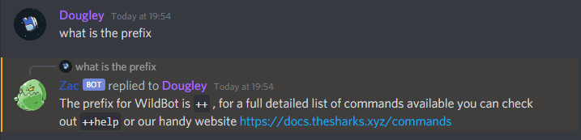

# Delirium 

A Discord auto-reply bot using [Dialogflow](https://dialogflow.cloud.google.com)

This project is inspired by [jagrosh/Phoenix](https://github.com/jagrosh/Phoenix)

---

## Selfhosting

#### Requirements
- Node.js version 12 or higher
- Dialogflow account & project

#### Running
1. Clone this repository
2. Run `npm install`
3. Set environment variables in `.env` or elsewhere, refer to `.env.example` for the required variables
4. Start the program with `npm start`

---

## DialogFlow

### Overview
DialogFlow is an API that is very similar in functionality to Siri, Alexa, Cortana, Google Assistant, etc. For this project, we're using the text-based, machine-learning portion to detect topics and when to produce replies. Conveniently, a DialogFlow agent can be edited collaboratively and updates immediately, so multiple people can provide topics and responses for the bot without having to restart the bot nor have access to the bot's hosting.

### Configuring
1. Create an agent (and set the token to the environment as listed above)
2. Delete the default fallback and welcome intents!
3. Create an intent (name doesn't matter but should reflect the topic of the autoreply)
4. Provide example phrases in the Training phrases and one or more replies in the Responses section (see image below)
5. Repeat steps 3-4 for every topic you want the bot to cover

